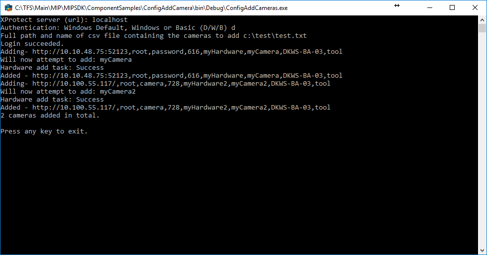

# Adding Cameras Using Configuration API

This sample shows how to add multiple cameras on an XProtect system. It
reads a file in comma-separated format containing necessary information
and then adds the cameras based on this.

## MIP Environment - .NET Library

In order to keep it simple this sample is a console application.

When connected to the server, the sample adds cameras based on
information from a file. The sample can be provided command-line
parameters for login and location of input file. If not provided as
command-line the console application will ask for the parameters. The
sample can be started like this:

- *ConfigAddCameras.exe* (Program now ask for address to connect to,
  user authentication method, user name, password and the name of the
  file (with full path))
- *ConfigAddCameras.exe http://localhost d test.txt* (In this example
  login on localhost using Default Windows authentication and read
  camera information from the file test.txt placed in the folder of
  the executable.

The file must have the following format:

~~~default
[Camera URL. IP or hostname and port],[Camera user name],[Camera password],[Driver number],[Name the hardware],[Name for the camera],[Name of the recording server],[Name of camera group]
~~~

Example:

~~~default
http://10.10.48.75:52123,root,password,616,myHardware,myCamera,REC007,myGroup
~~~

In this example we add a camera using the MIP Driver (i.e.
CameraMetadataProvider sample), MIP driver is Hardware ID number 616.
(See <a href="https://www.milestonesys.com/support/software/supported-devices/xprotect-corporate-and-xprotect-expert/" target="_blank">Driver page</a>)

The camera is on the address http://10.10.48.75:52123, has the admin
user \"root\" with the password \"password\". The camera should be added
to the recording server with the name \"REC007\". When added the
hardware name will be \"myHardware\", the camera name \"myCamera\" and
the camera will be put in a camera group named \"myGroup\". The camera
group will automatically be created if it does not already exist.

The file can have multiple lines each line having the information for
one camera.

## The sample demonstrates

- Retrieve OAuth token for credentials provided by operator
- Log in to the Management Server using the OAuth token
- Usage of strongly typed Configuration API classes to add a camera to
  the VMS and specify the name and group for it.

## Using

- VideoOS.Platform.ConfigurationItems
- VideoOS.Platform.ConfigurationItems.ManagementServer
- VideoOS.Platform.ConfigurationItems.ServerTask

## Environment

- .NET library MIP Environment

## Visual Studio C\# project

- [ConfigAddCameras.csproj](javascript:clone('https://github.com/milestonesys/mipsdk-samples-component','src/ComponentSamples.sln');)
