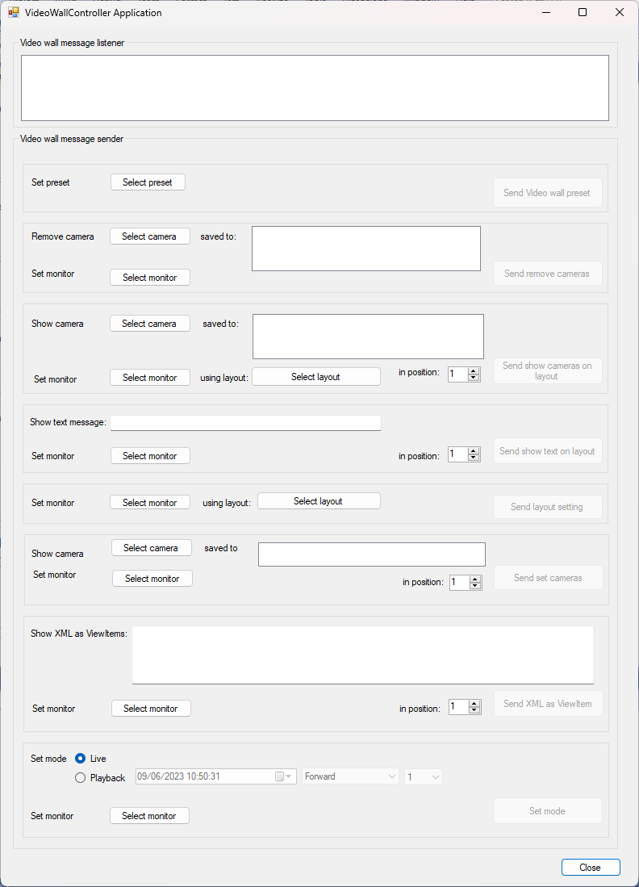

# Video Wall Controller

The VideoWallController sample demonstrates how to manage a Video Wall.

Display what changes are been applied to monitors by Smart Clients,
rules or other applications.

Commands to change monitor content:

- Apply XML on monitor starting in a specific index, with one or more
  viewitems
- Apply the preset on the selected monitor
- Remove camera(s) from the specified monitor
- Show camera(s) on one monitor from the specified position on the
  specified layout
- Show text message on the specified position in the current layout on
  the specified monitor
- Replace current layout of one monitor with specified layout
- Show camera(s) on the monitor from specified position
- Change mode between live and playback

## The sample demonstrates

- The commands to send to the video wall(s)
- Using messaging to listen to VideoWallIndication

## Using

- VideoOS.Platform
- VideoOS.Platform.Messaging.MessageCommunicationManager
- VideoOS.Platform.Messaging.CommunicationIdFilter
- VideoOS.Platform.ConfigurationItems.Monitor
- VideoOS.Platform.UI.ItemPickerForm

## Environment

- MIP .NET library

## Visual Studio C\# project

- [VideoWallController.csproj](javascript:clone('https://github.com/milestonesys/mipsdk-samples-component','src/ComponentSamples.sln');)

## Special notes

To play with the sample, there are some prerequisites: in Management
Client, the user shall at least set up one Smart Wall, one monitor on it
and one preset with a layout.

A hidden feature to get XML in the "Show XML as ViewItems" input text box is to use items in "Video wall message listener". When commands are sent, they are displayed in the listener text box in the top. To get the XML of any of these commands, simply click on the command in the list box and the XML will be shown in the "Show XML as ViewItems" input text box.
